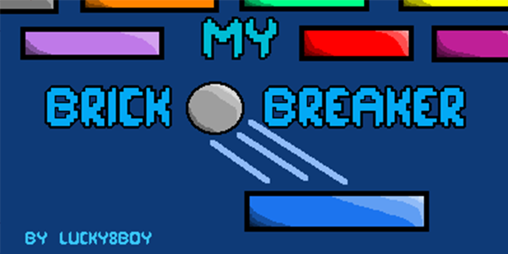

# My Brick Breaker
A game made in Java using Swing and AWT. The theme is simple: "Brick Breaker". Can you finish all of the 5 levels without losing?

# About the game
This game has a main menu and 5 levels. They can be edited by changing the values found in the .txt files in the "levels" directory.

# Songs
Yes. The songs are modified and most parts created by me in a midi editor.
Link to OST: [My Brick Breaker OST](https://www.youtube.com/watch?v=BWBnVE5QZM4)
